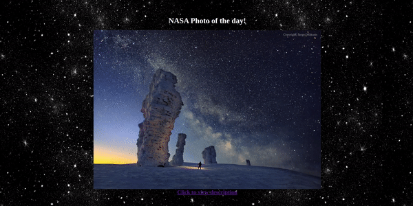

<h1 align="center">NASA APOD</h1>

<p align="center">
  
</p>


## Introduction

This project displays the NASA Astronomy Picture of the Day!

## Technologies
* Python
* HTML/CSS
* Flask Web Framework

## How to Run
To run this web application you must run 
```
python3 nasaapi.py
```
This will produce a link that can be opened in your web browser of choice.

